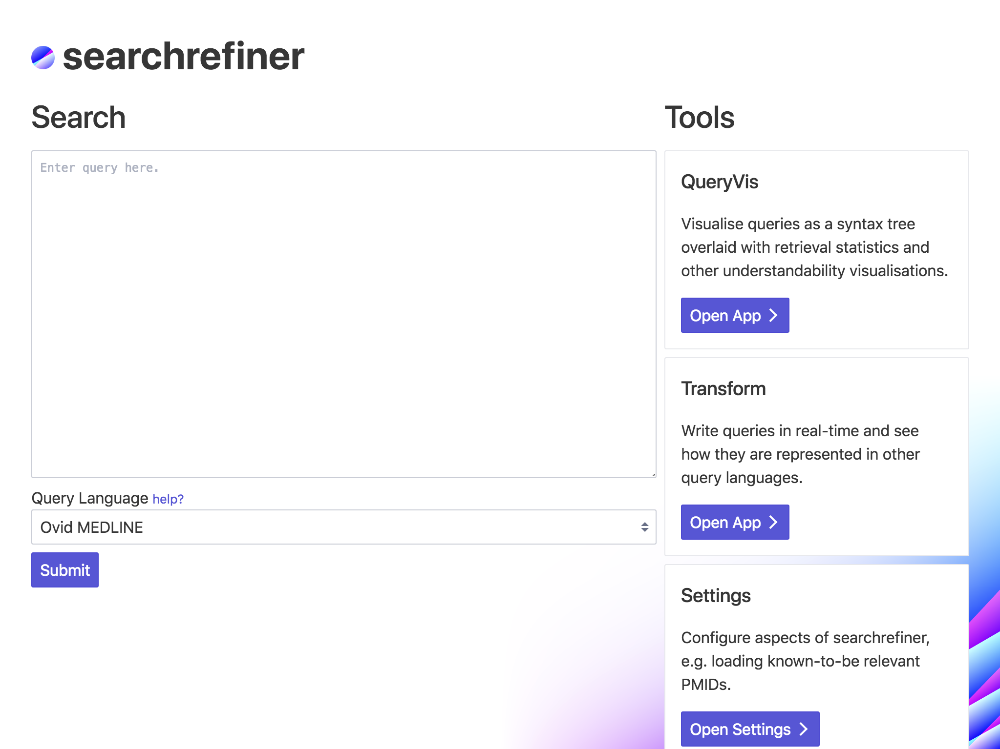

# CiteMed

_Systematic Review Query Visualisation and Understanding Interface_

CiteMed is an interactive interface for visualising and understanding queries used to retrieve medical literature for
[systematic reviews](https://en.wikipedia.org/wiki/Systematic_review). CiteMed is an open source project; the source is
made available on [GitHub](https://github.com/ielab/citemed). It is currently in development, however you may preview 
the interface at this [demo link](http://43.240.96.223:4853/) (note that users must be approved prior to use).

## Links

 - Visit the [demo](http://43.240.96.223:4853/).
 - Read how to [set-up](setup.md) a local version.
 - Read how to [authenticate](authentication.md) programmatically.
 - Read what [APIs](api.md) are exposed.
 - Read what [tools](tools.md) are made available in the interface.
 - View the source on [GitHub](https://github.com/ielab/citemed).
 - Read the [documentation](http://43.240.96.223:4853/help) on using the interface.
 - Contribute to [development](https://github.com/ielab/citemed/issues).
