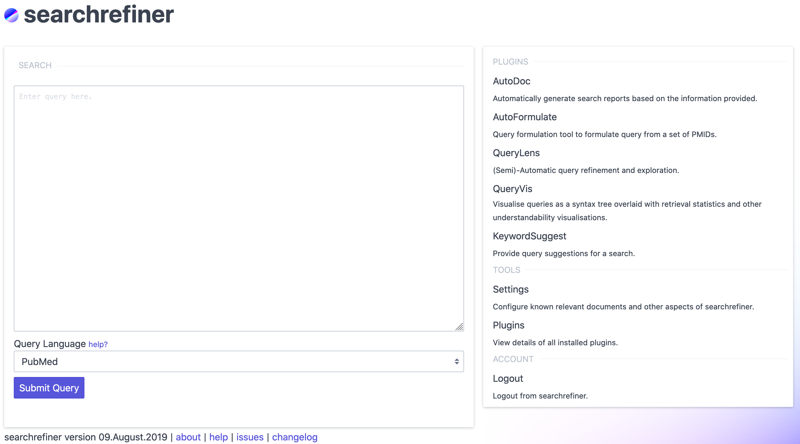

_Systematic Review Query Visualisation and Understanding Interface_

<!--
    

        <article class="card">
            <footer>
                 Read the <a href="https://dl.acm.org/citation.cfm?id=3269215">paper</a>!
            </footer>
        </article>
    

-->
    

        <article class="card">
            <footer>
                 <b>Use <a href="http://ec2-3-106-54-166.ap-southeast-2.compute.amazonaws.com">searchrefiner</a></b>
            </footer>
        </article>
    

    

        <article class="card">
            <footer>
                 Read the <a href="documentation">documentation</a>
            </footer>
        </article>
    

    

        <article class="card">
            <footer>
                 Discover <a href="tools">tools</a>
            </footer>
        </article>
    
    

searchrefiner is an interactive interface for visualising and understanding queries used to retrieve medical literature for
[systematic reviews](https://en.wikipedia.org/wiki/Systematic_review). searchrefiner is an open source project; the source is
made available on [GitHub](https://github.com/ielab/searchrefiner). It is currently in development, however you may preview 
the interface at this [demo link](/searchrefiner/demo) (note that users must be approved prior to use).

<!--

    <iframe width="560" height="315" src="https://www.youtube-nocookie.com/embed/HPEQWCrMGWw" frameborder="0" allow="accelerometer; autoplay; encrypted-media; gyroscope; picture-in-picture" allowfullscreen></iframe>
    <iframe width="560" height="315" src="https://www.youtube-nocookie.com/embed/A1GtoNFWN0c" frameborder="0" allow="accelerometer; autoplay; encrypted-media; gyroscope; picture-in-picture" allowfullscreen></iframe>

-->

