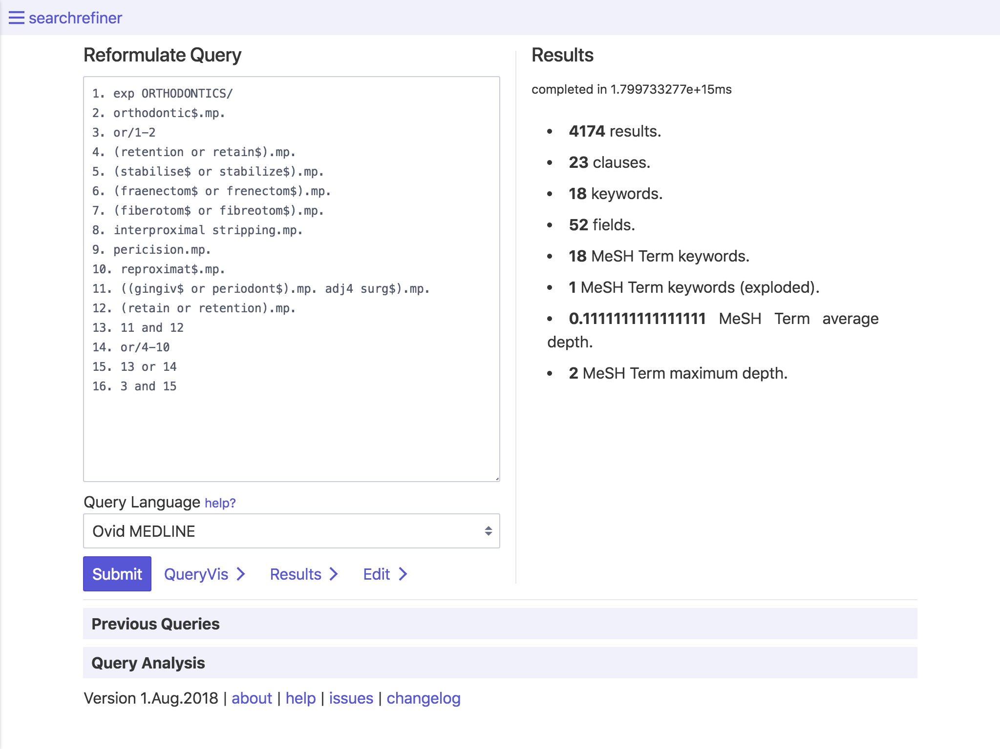
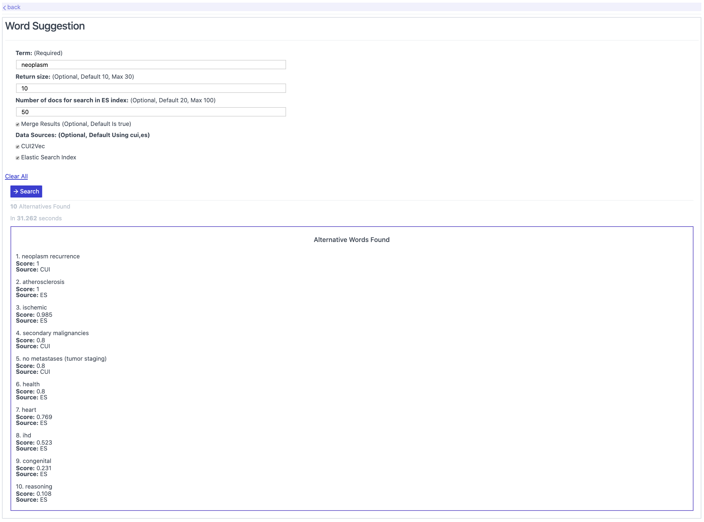
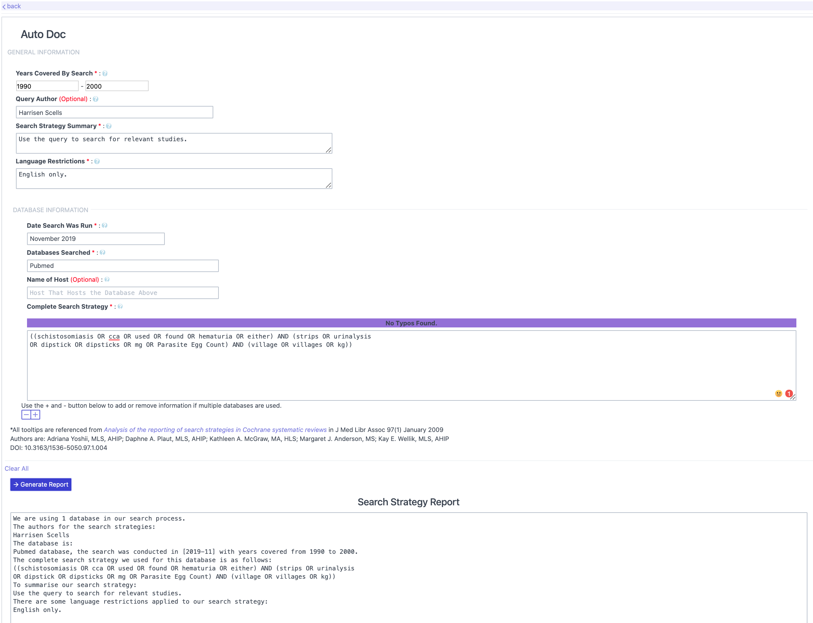
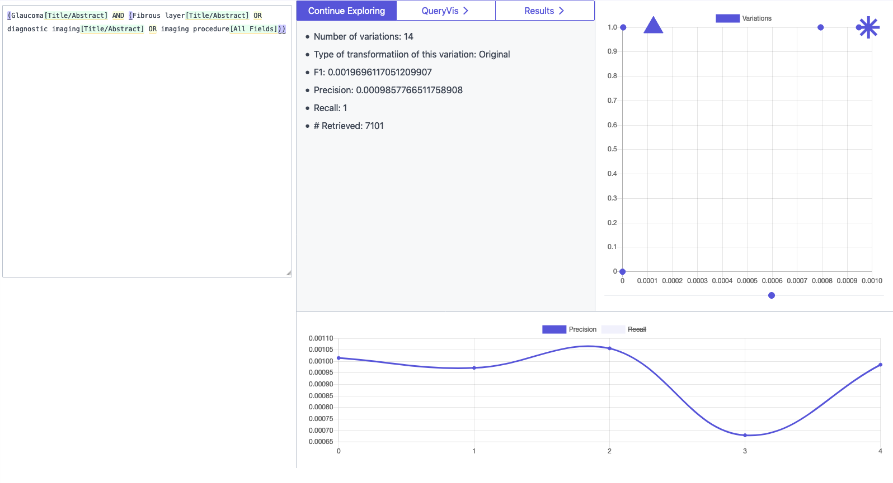
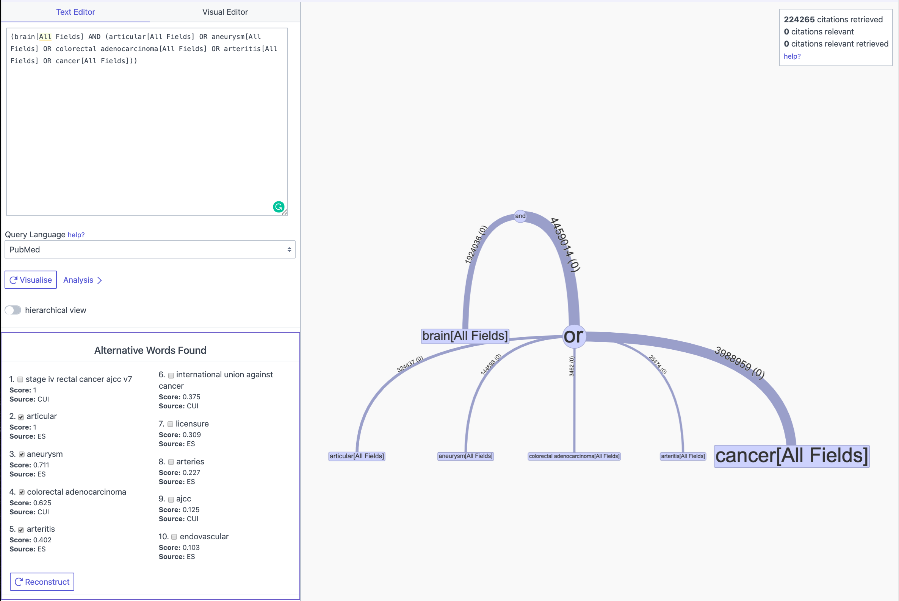

searchrefiner currently has three tools:

 - Query interface: for exploring retrieval statistics and retrieved citations.
 - QueryVis: for exploring a query as a tree representation and for editing the query with a structured editor.
 - Transform: for directly manipulating the abstract syntax tree of queries.

