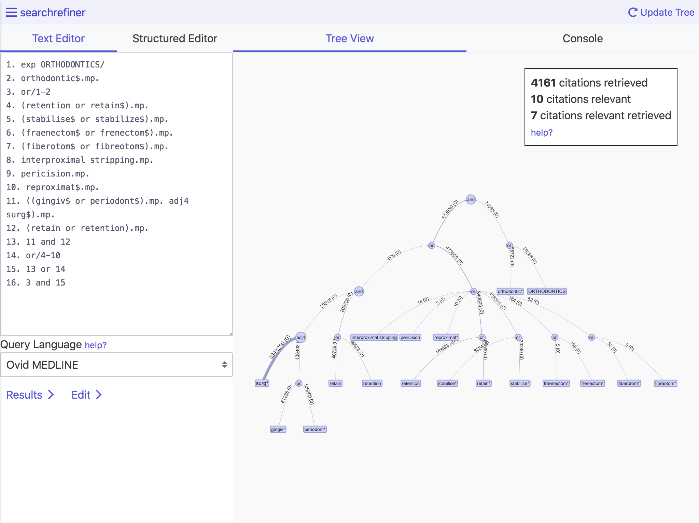

# Tools

searchrefiner currently has three tools:

 - Query interface: for exploring retrieval statistics and retrieved citations.
 - QueryVis: for exploring a query as a tree representation and for editing the query with a structured editor.
 - Transform: for directly manipulating the abstract syntax tree of queries.
 

## Further Links

 - [Home](index.md)
 - [Set-up](setup.md)
 - [Authentication](authentication.md)
 - [API](api.md)
 